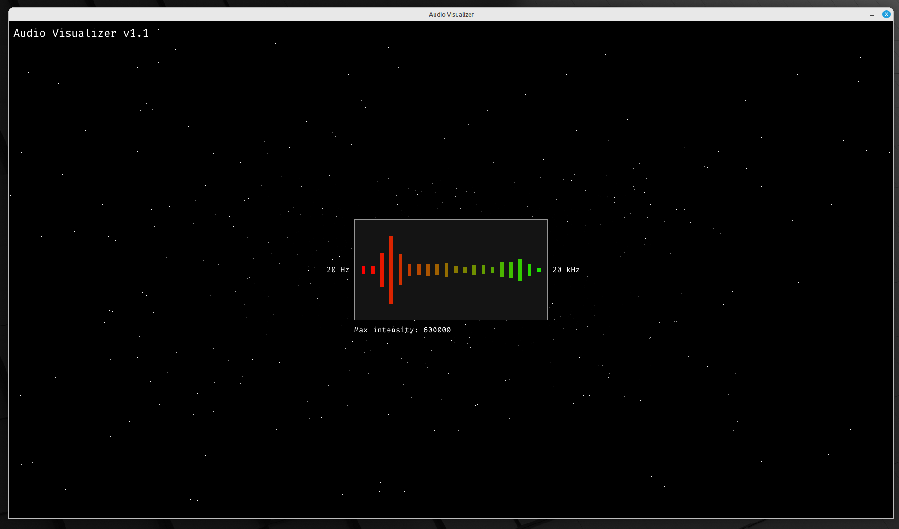

# Audio Visualizer

(There is also an example video in the `.github` folder)

## Installation

#### Note: Only works on Linux!
 
The Audio Visualizer was designed to be used with Apple's AirPlay feature. However, you can manually set the audio input to be basically anything Alsa-compatible. If the input device of your choice is visible in the list when you type `aplay -l` in your terminal, it can be used. If you wish to do so, you can skip the rest of this guide.

To use Audio Visualizer with AirPlay, you must install Shairport Sync. You can find the installation guide [here](https://github.com/mikebrady/shairport-sync).

After installing Shairpot Sync, you must set the audio output to Loopback in the Shairport Sync configuration file. I also recommend setting the input volume to max and disabling the volume controls. Otherwise you will have to manually make sure that the input volume is sufficient.

> /etc/shairport-sync.conf

    general = {
	    name = "Audio Visualizer"; // This will be the name of the AirPlay device
	    volume_control_profile = "flat";
	    ignore_volume_control = "yes";
    };
    
    sessioncontrol = {
	    startup_volume_db = 0.0;
    };
    
    alsa = {
	    output_device = "hw:Loopback,0";
	    output_rate = 44100;
	    output_format "auto";
    };

The loopback device is not available by default on your computer, so you will need to load the snd-aloop module with `sudo modprobe snd-aloop`. If you wish, you can set the module to be loaded at boot by adding it into the `etc/modules-load.d/modules.conf` file. This way you don't have to manually load the module every time after rebooting your computer.

## Building

To compile Audio Visualizer, you will need these libraries to be installed on your computer:

| Library | Installation command |
|---|---|
| SDL2 | sudo apt install libsdl2-dev |
| SDL2_ttf | sudo apt install libsdl2-ttf-dev |
| FFTW3 | sudo apt install libfftw3-dev |

In the `lib/main.h` file you can edit the input and output devices and the window resolution. If the program crashes unexpectedly, setting the output device manually can help. After modifying this file run `make clean`. Otherwise the changes won't take effect.

To build the program, simply run `make` in the root directory. If the build was successful, you should see an executable called `audio_visualizer` in the root directory.

## Usage

Either double click the executable or run `./audio_visualizer` in your terminal. You can use `Up` and `Down` arrow keys to control the maximum intensity of the audio. `Return` key resets the value to default. So if the bars barely move at all, you should reduce the maximum intensity and vice versa.
